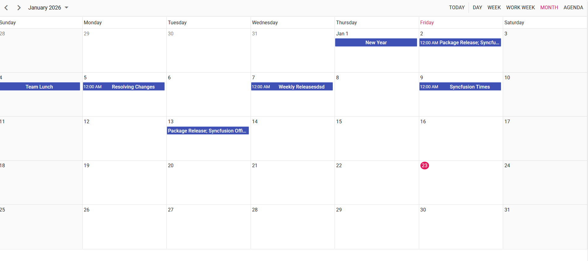
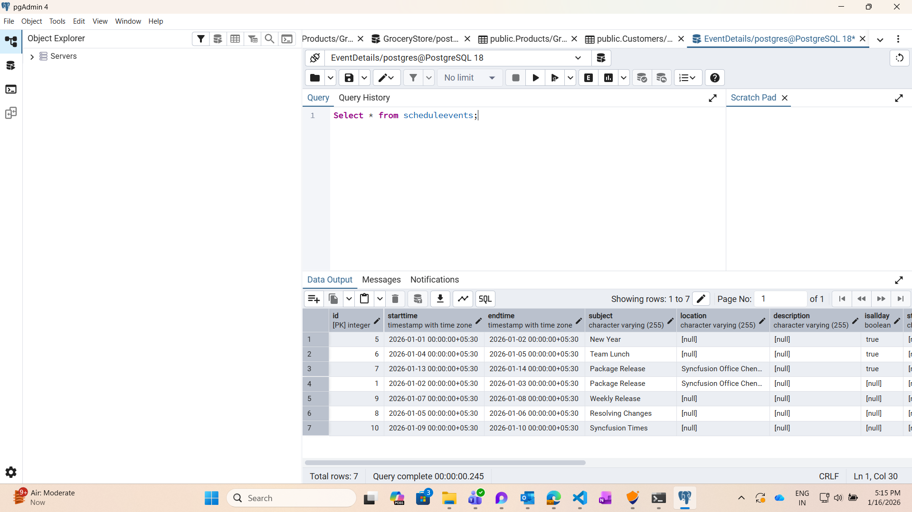

<!--
  howto.md
  A step-by-step guide to integrate PsotgreSQL with Syncfusion React Scheduler using Node.Js
-->
# How to Integrate PostgreSQL with Syncfusion React Scheduler using Node.Js

This repository contains a sample full-stack application demonstrating how to synchronize events between PostgreSQL and the Syncfusion React Scheduler component.The Node.js backend handles CRUD operations on Scheduler events using a PostgreSQL database, and the React frontend delivers a modern, responsive scheduler interface for interacting with those events.


## Prerequisites

- Node.js (>= 20.19)
- npm (>= 7.0)
- react (>= 18.0)
- A PostgreSQL Database with Username and Password (create at https://www.postgresql.org/download/)
- Basic familiarity with React and PostgreSQL Query
- Make sure the ports nothing run on 8080 , 8081

## Project Structure
```
├── README.md                           # This guide
├── backend                             # Node.js backend
│   ├── config    
│   │    ├── db.config.js               # Database Configuration
│   ├── controllers
│   │    ├── scheduler.controller.js     
│   ├── models
│   │    ├── index.js     
│   │    ├── scheduler.model.js     
│   ├── routes
│   │    ├── scheduler.routes.js     
│   ├── package.json
│   └── server.js                       # Express server
├── public
│    ├── index.html
├── src
│    ├── App.css       
│    ├── App.js                         # Scheduler Configuration
│    ├── App.test.js
│    ├── index.css
│    ├── index.js
│    ├── logo.svg
│    ├── reportWebVitals.js
│    ├── setupTests.js    
├── .env                                #Environment Variables
│── package.json

```
## Setup

### Cloning the repository
    
- Clone the repository to your local machine

### Backend Setup

### Installation
1. Open a terminal and navigate to the backend folder:
    ```bash
    cd backend
    ```
2. Install dependencies:
    ```bash
    npm install
    ```

### PostgreSql Configuration
- Create a PostgreSQL user with a chosen username and password and create a new database name as `eventdetails`.
- In `backend/config/db.config.js` file update the USER, PASSWORD, and DB as per the database configuration.

    ```ini
    USER=<your-user-name>
    PASSWORD=<password-for-specific-user>
    ```

### Available Endpoints
The Express server (`server.js`) exposes the following REST routes:
| Method | URL                          | Description                         |
| ------ | ---------------------------- | ----------------------------------- |
| POST    | `/getData`    | List events in the given time range |
| POST   | `/crudActions`                | Create a new ,edit and delete event.                  |                    |

### Frontend Setup

### Installation

1. Open the project directory in terminal to install the required packages. 

    ```bash
    npm install
    ```

### Running the Application
1. Open a terminal and navigate to backend folder
      ```bash
    cd backend
    ```
2. Start the backend server:
    ```bash
    node server.js
    ```
3. Server started running on `http://localhost:8080`
4. Open another terminal and start the frontend:
    ```bash
    npm start
    ```
5. Navigate to [`http://localhost:8081`](http://localhost:8081) in your browser.


6. You can perform CRUD operation on the scheduler that will be reflected in the postgreSQL database table.


## Output Preview

*Image illustrating the Syncfusion React Scheduler*


*Image illustrating the events of Syncfusion React Scheduler in PostgreSQL*

## Troubleshooting
- **401 Unauthorized**: Check `User`,`Password` and `DB` in `db.config.js` in `backend`.
- **CORS errors**: Ensure frontend calls runs on `localhost:8081` 